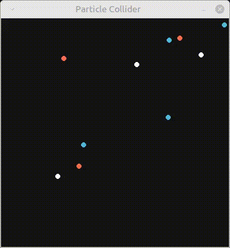

# Particle collider
The Project aim is to demonstrate use of multiprocessing parallelization of Computation and Visualization part.

## Original project
Original project was forked from [EruditeCode/particle_collider](https://github.com/EruditeCode/particle_collider). Original implementation performs Pygame visualization and particle movement computation in a single process. This leads to limitation of number of particles being used as too many particles results in laggish visualization.

## CPU bound problem
The problem, when there is too much computation in a single program thread resulting in insufficient resources being left for visualization, is a typical CPU bound task. The problem can be solved by using more computational resources e.g. CPU cores and this is, where Multiprocessing module comes into play (in case of Python implementation)

To visualize the problem, compare Fig. 10_particles showing simulation, where only 10 particles are simulated, versus Fig. 1000_particles depicting simulation with 1000 particles.

  <figure style="text-align: center;">
    
    <figcaption>Fig: 10_particles</figcaption>
  </figure>
  <figure style="text-align: center;">
    
    <figcaption>Fig: 1000_particles</figcaption>
  </figure>

  <!--img src="./imgs/10_particles.gif" width="200"/>
  

